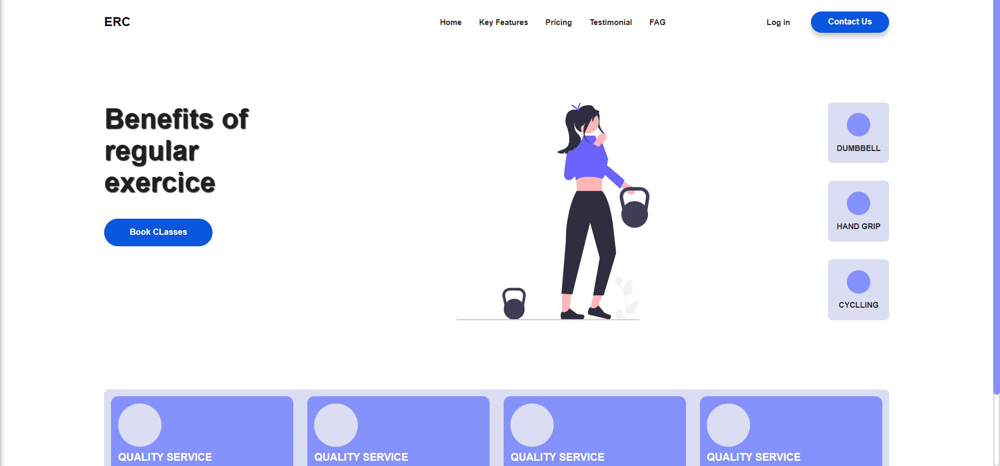
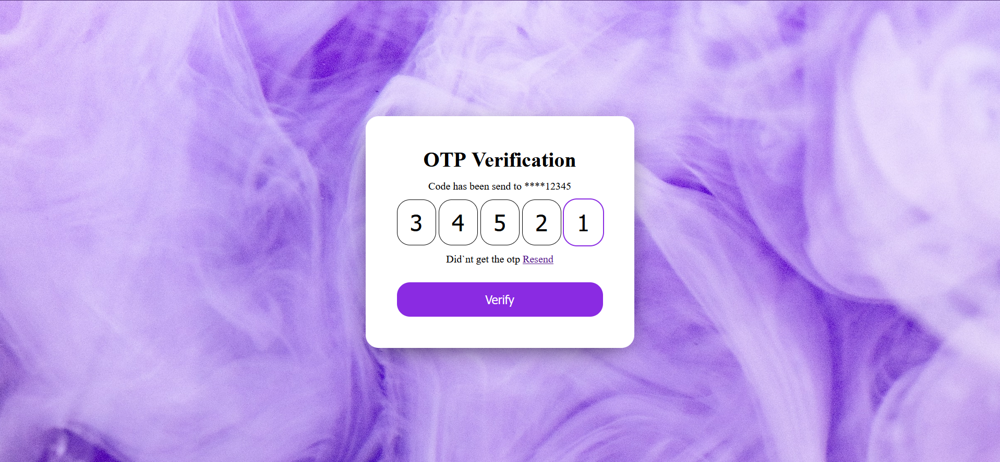

# There are many examples how you can practice HTML, CSS AND JS. I hope I help you.

# Portfolio

# Login-Page

# Exercice

# Otp Validation

# Timer

# Random Number

# Login Page

# Login Card

# Login Animated

# Form Validation

# Exercice

# Digital Watch

# Credit Card

